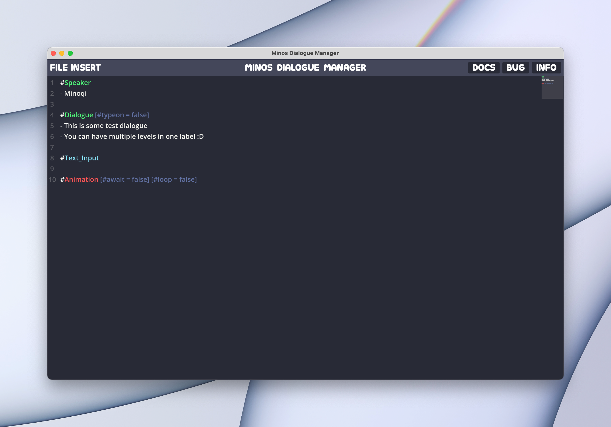
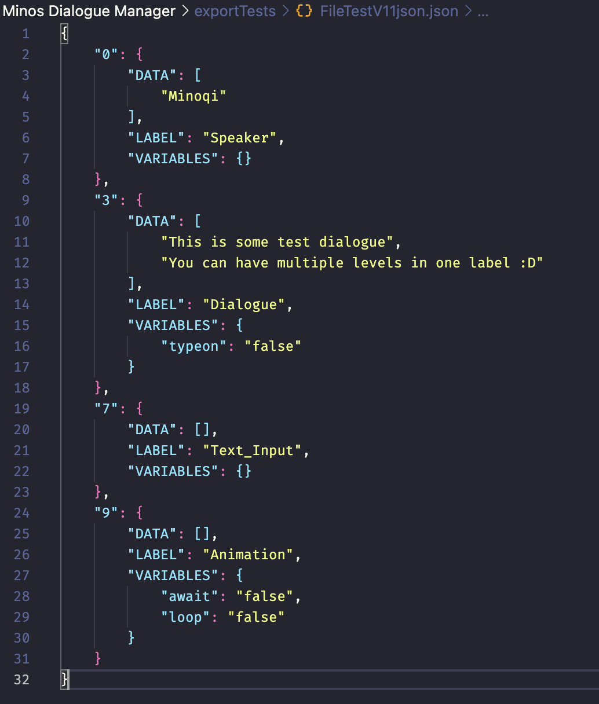

Hello! I've been working on the tool again and have some good news, session 1 of export testing has succeeded! The issue with it ignoring multiple variables has been fixed >:) 

I'm hoping to be able to have the exports fully working by next week. I'm currently looking into how to support export data for a few of the label options like if statements. I'm hoping this won't take me too long though. Once the exports are in, adding in the remainder shouldn't be too difficult (I hope lol).

I've included some photos of how it's looking, as you can see, a minor change was made to how the data is written out in the tool, using "-" now as an indicator that this is data that belongs to the label. The way the JSON export file looks has also been updated. I will update the documentation to reflect this change once this update has been pushed :)

---

*Want to leave a comment? You can over on the [itchio blog post](https://minoqi.itch.io/minos-dialogue-manager/devlog/763051/breakthrough-on-exporting-data-progress).*